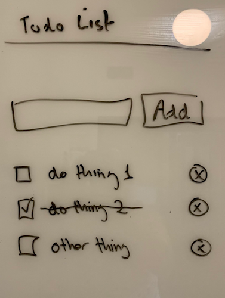

# To Do List

## Overview

This full stack application allows users to add, edit, and delete items from a to do list.  The app makes use of a component-like architecture built with JavaScript.  Development features include the ability to create tables, drop tables, and load seed data with respect to the postgreSQL database. Error messages are .  The authentication process includes hashing passwords and utilizing ensure-auth middleware to preseve user login.  

## Technology

* PostgreSQL
* NodeJS
* JavaScript
* bcryptjs
* cors
* jsonwebtoken
* morgan

## App Features

* Secure user authentication with signup/login with hashed password
* User can add todo items to list of todos
* List of user's todos is displayed
* Todos can be toggled to/from complete/incomplete
* Todo can be removed by a user

## Custom Components

- `TodoApp`
    - `AddTodo` (props: `onAdd`)
    - `TodoList` (props: `todos`, `onUpdate`, `onRemove`)
        - [`TodoItem`] (props: `todo`, `onUpdate`, `onRemove`)
    

## API Services

1. `getTodos()`
1. `addTodo(todo)`
1. `updateTodo(todo)`
1. `removeTodo(todoId)`

## Server 

Route | SQL
---|---
`GET /todos` | `SELECT`
`POST /todos` | `INSERT` w/ `RETURNING`
`PUT /todos/:id` | `UPDATE` w/ `RETURNING`
`DELETE /todos/:id` `DELETE`
